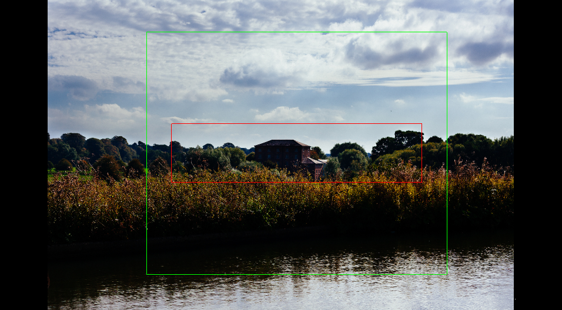
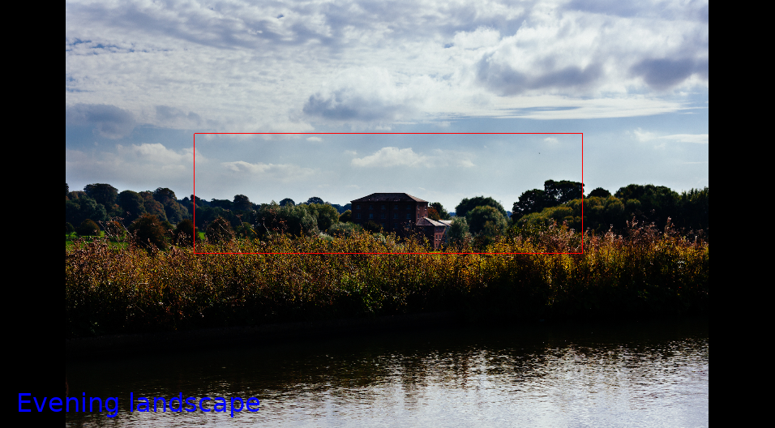

# Image Marker

Graphical program to quickly mark rectangular areas in a batch of images and save the output as a CSV, optionally
adding a text note to each of the marks.

The **output CSV** file (space-separated) contains on each row an image path with the coordinates of the marked
rectangle. Example:

``` csv
./test_images/building.jpg 350 237 909 547
./test_images/canal.jpg 530 533 1075 252
```

The general format is:

``` csv
<image path> <left px> <top px> <width px> <height px>
```

This is all Image Marker does. It's completely up to you how to use this CSV output.

- An obvious option though, is to **crop the images**. For that I've created a small script
[image-crop](https://lab.saloun.cz/jakub/image-crop).

## Installation

```
pip install --user --upgrade .
```

## Help

```
image-marker --help
```

## Basic concepts

### Browsing images

Image Marker operates on a directory of images.

It displays one image at a time. You can change the displayed image using your **keyboard arrow keys**.

The images are always scaled to fit in the window of the program. There is no zoom option.

### Adding marks

On each image you can select with your mouse a rectangular area. This is what we call a **mark**. The mark will appear
on the screen as a **red rectangle**.


### Saving the marks

Use the option **`--marks`** to specify a CSV file path, in which the coordinates of the marked rectangles will be saved.

Use the option **`--output`** to specify a CSV file path, in which the post-processed coordinates will be saved.

### Post-processing options

By default the values stored in the **`--marks`** and **`--output`** CSV files are the same.

However, it is possible to make some automatic adjustments to your marked rectangles. There is currently one such
scenario:

#### Box

If you want to automatically draw a **box** around your marked rectangles with a specific aspect ratio, use the option
**`--box-ratio`**. This way, you can just mark the part of the image that contains the subject that you are interested
in, but all your marks will become rectangles of the same aspect ratio, thus forming a nicely unified collection.

The box will be rendered symmetrically around the marked area as a **green rectangle** and always have the
specified aspect ratio (unless it wouldn't fit in the image).


You can also specify a **box padding** with the option **`--box-padding`** to make the box a little further from the
original marked rectangle. The padding is specified as a fraction of marked area width. Example: option
`--box-padding 0.15` will result in a 30 px padding for a 200 px wide selection.



## Adding notes

You can add text to each image. Just start typing any characters, the text will appear in **blue** by the bottom of the
image. You can delete what you've typed with the backspace key.



## Controls

- **right arrow** or **down arrow** or **enter**: show next image
- **left arrow** or **up arrow**: show previous image
- **left mouse click and drag**: mark a rectangular area
- **mouse click without drag**: delete currently marked area
- **escape**: exit the program (all marks are automatically saved)
- **alphanumeric keys (letters and numbers)**: add text note to the current image
- **backspace**: delete the last character of the text note

## Example workflow

1. Put the images that you want to mark in one directory, let say `my_directory/`.

2. Run image-marker:

   ```
   image-marker ./my_directory/ --marks my_marks.csv --output my_output.csv --box-ratio 1.33 --box-padding 0.1
   ```

3. A window will appear with the first image in the directory.

4. Draw the first rectangle with the mouse on the image.

5. If you're not happy with it, draw it again. The previously drawn rectangle will disappear.

6. Press left arrow key to advance to the next image.

7. You can go back to the previous image by pression the left arrow key. The rectangle that you've drawn before will
still be there.

8. The marks and output CSV are written immediately. You can quit the program any time by pressing the escape key.

## Contributing

__Feel free to remix this piece of software.__ See [NOTICE](./NOTICE) and [LICENSE](./LICENSE) for license information.
