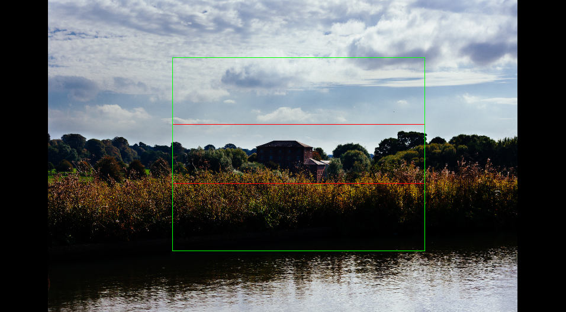

# Image Marker

Graphical program to quickly mark rectangular areas in a batch of images and save the output as a CSV, optionally
adding a text note to each of the images.

The **output CSV** file contains on each row an image path with the coordinates of the marked rectangle. Example:

``` csv
./test_images/building-2.jpg 350 237 909 547
./test_images/canal-2.jpg 530 533 1075 252
```

The general format is:

``` csv
<image path> <left px> <top px> <width px> <height px>
```

This is all Image Marker does. It's completely up to you how to use this CSV output.

- An obvious option though, is to **crop the images**. For that I've created a small script
[image-crop](https://lab.saloun.cz/jakub/image-crop).

## Installation

```
pip install --user --upgrade .
```

## Help

```
image-marker --help
```

## Basic concepts

Image Marker operates on a directory of images.

It displays one image at a time. You can change the displayed image using your **keyboard arrow keys**.

The images are always scaled to fit in the window of the program. There is no zoom option.

On each image you can select with your mouse a rectangular area. This is what we call a **mark**. The mark will appear
on the screen as a **red rectangle** and will be stored in the CSV file passed as the `--mark` argument.

But default the same values get stored in the CSV file passed as the `--output` argument.


You might be wondering why there are two outputs: `--mark` and `--output`. The reason is that it can happen, that you
want to

If you want all your marks to have the same aspect ratio, use the option `--box-ratio`.

Then a **box** will be rendered symmetrically around the marked area as a **green rectangle** and always have the
specified aspect ratio (unless it wouldn't fit in the image).



You can also specify a **box padding** to make the

with option is passed, another rectangle will appear on the screen. It will have the exact aspect
ratio

## Controls

- **right arrow** or **down arrow** or **enter**: show next image
- **left arrow** or **up arrow**: show previous image
- **left mouse click and drag**: mark a rectangular area
- **mouse click without drag**: delete currently marked area
- **escape**: exit the program (all marks are automatically saved)

1. Put the images that you want to mark in one directory.
2. Start image-marker:

```
image-marker ./my_directory/
```
