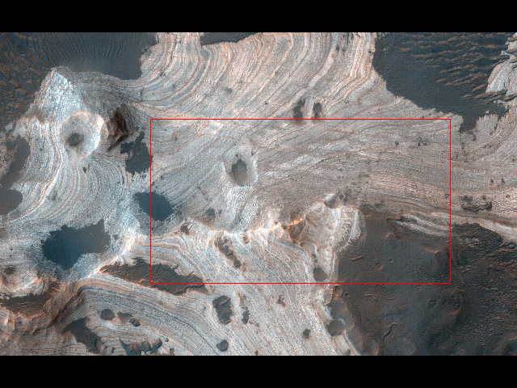
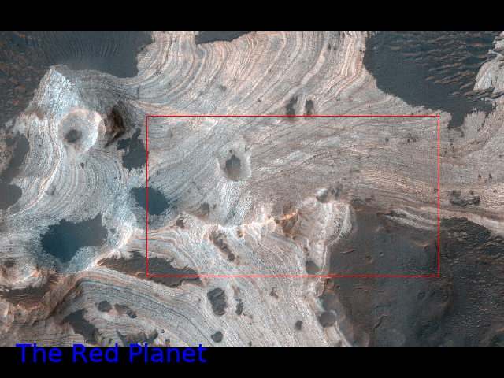
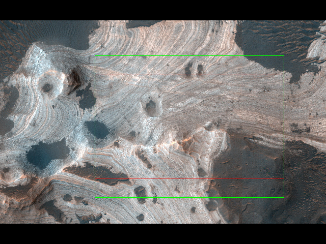
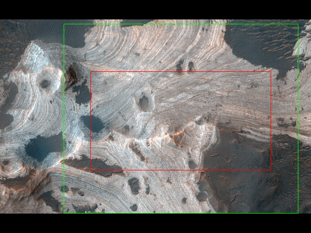

# Image Marker

A graphical program to mark rectangular areas in a batch of images and save
their coordinates as a CSV. Optionally, add a text note to each of the
images. Optimized for a fast workflow.


Output CSV format:

``` csv
<image path> <left px> <top px> <width px> <height px>
```

Example:

``` csv
./test_images/building.jpg 350 237 909 547
./test_images/canal.jpg 530 533 1075 252
```

This is all Image Marker does. You can do whatever you want with the output
CSV. One obvious option is to crop the images according to the marks. You can
use [image-crop](https://github.com/jakubvalenta/image-crop) for that.

## Installation

``` shell
pip install --user --upgrade .
```

## Usage

1. Put all the images you want to mark in a single directory.

2. Run Image Marker:

    ``` shell
    image-marker ./my_directory --marks my_marks.csv --output my_output.csv --box-ratio 1.33 --box-padding 0.1
    ```

    The positional argument specifies the directory to load the images from.

    The option `--marks` specifies the CSV file path, where the coordinates of
    the marked rectangles will be saved.

    The option `--output` specifies the CSV file path, where the post-processed
    coordinates will be saved. More on that later.

3. A window will appear with the first image in the directory. Use the mouse to
   draw a rectangular mark. The output CSV files are saved immediately.

    

    If you're not happy with the mark position or size, draw it again. The
    previously drawn rectangle will disappear.

4. Use the <kbd>right</kbd> arrow key to advance to the next image.

    You can also go back using the <kbd>left</kbd> arrow key.

5. Type any characters on your keyboard to add a text note to an image. It will
   appear in blue by the bottom edge of the window. You can delete what you've
   typed using the <kbd>backspace</kbd> key.

    

6. Quit the program by pressing the <kbd>esc</kbd> key.

### Mark post-processing

By default the values stored in the `--marks` and `--output` CSV files are the
same.

However, it is possible to make some automatic adjustments to your marks. In
this case, the original marks will be stored in the `--marks` CSV file and the
post-processed marks in the `--output` CSV file.

There is currently one post-processing option:

#### Box

If you want to create a set of marks that all have the same aspect ratio, you
can use the option `--box-ratio` to automatically draw a box around each mark
with a specified aspect ratio. The box will be drawn symmetrically around the
marked area as a green rectangle. If the box doesn't fit in the image, it will
be moved in the image.



You can also add padding to the box using the option `--box-padding`. It is
defined as a fraction of the marked rectangle width. For instance `--box-padding
0.15` will result in a 30 px padding for a 200 px wide mark.



## Controls

- <kbd>right</kbd> or <kbd>down</kbd> or <kbd>enter</kbd>: show next image
- <kbd>left</kbd> or<kbd>up</kbd>: show previous image
- left mouse click and drag: draw a mark
- left mouse click (no drag): delete current mark
- <kbd>esc</kbd>: exit the program (all marks are automatically saved)
- letter and number keys: add text note to current image
- <kbd>backspace</kbd>: delete the last character of the text note

## Help

``` shell
image-marker --help
```

## Contributing

__Feel free to remix this piece of software.__ See [NOTICE](./NOTICE) and
[LICENSE](./LICENSE) for license information.
